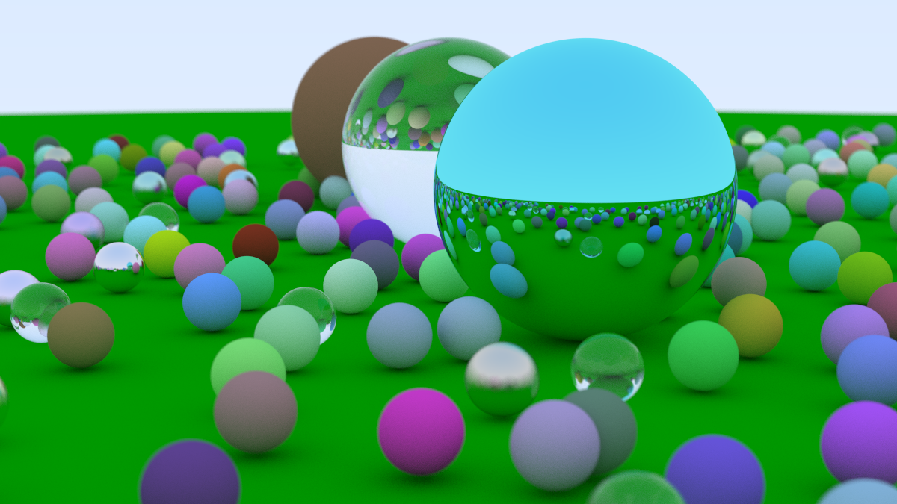

Raytracing in one weekend, written in zig.

The book uses a very C++ OOP-centric style of programming. The code maps to Zig simply, with the exception of interfaces. Idiomatic Zig implements interfaces through manually defining and implenting a vtable (see std.mem.Allocator)

